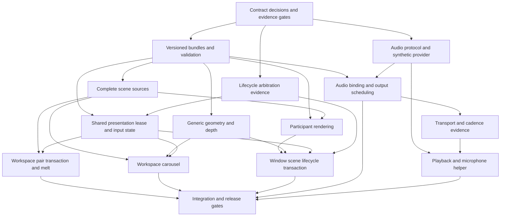

# Programmable effects: design specification and implementation plan

Status: shareable design-review draft; architectural review completed, runtime
implementation not started. This is the canonical specification and delivery plan
for this work. Reviewed against effects PR1 (`512e2fb3`, #321) and the
PR2 checkout (`b1e33849`, #336). This is the upstream configuration/ABI baseline;
divergent fork schemas require a separate integration review. Three independent
reviews covered rendering, compositor lifecycle/configuration, and audio; the
project lead integrated and challenged their recommendations. This document
selects the initial architecture.
The specification also incorporates Weegs's source review and the follow-up
decisions on descriptor storage, resource admission, helper supervision and
acceptance evidence. These are design decisions, not prototype results.
The [transition requirements](scene-transitions.md) and
[audio requirements](audio-inputs.md) retain the motivating examples and detail.
Those supporting notes provide rationale and examples; this document defines
the release scope, decisions, dependencies and acceptance gates.

Implementation may begin with the bounded experiments below. Public ABI release
depends on their evidence. This review did not run rendering prototypes or
validate performance, and does not represent upstream scope approval.

## Review guide

This document can be shared on its own for design review. The required outcomes
are user-authored GLSL transitions and shared audio inputs, extending PR1/PR2:

- Scene-wide window animations (`window_scene`) on opening **and closing**,
  moving neighbouring windows and forming/dissolving the target within existing
  lifecycle deadlines.
- A 3D workspace carousel for variable workspace counts, with equal face canvases,
  default viewport framing and optional fit-all framing. Workspaces containing
  1, 4, 2 and 0 windows keep equal faces; selection returns to the normal viewport.
- The whole outgoing workspace melts away to reveal an intact destination.
- Explicitly selected system playback and microphone input supply the same
  audio feature interface to existing effect kinds and the new transitions.

Review the architecture and triage first, then the interfaces, resource policies
and acceptance gates. In particular, review the initial `window_scene`
compatibility restriction, input-dismissal policy, layer inclusion, and overlap
fallback as product decisions. Stage/config names, protocol/profile constants
and budgets are concrete proposed contracts pending the C0/C1 evidence gates,
not shipped APIs or measured performance claims. Execution starts with those
experiments; their results must be recorded before the public interface is
frozen.

## Outcome and idea triage

Build on the existing effect presets, `EffectRegistry`, animation clock,
owner-local selections and UmbrielFX renderer. Add output-scoped presentation
transactions and shared audio inputs. Keep rendering in UmbrielFX and capture/
analysis in an external audio helper, preserving the single-threaded compositor.

| Idea | Decision | Reason / acceptance obligation |
| --- | --- | --- |
| Whole-workspace melt | Required initial capability | Retain outgoing scene and reveal an independent, intact destination |
| 3D workspace carousel | Required initial capability | Display and navigate N live workspaces; 1, 2, 3, 4, 5 and 8 must work |
| Scene-wide window animation (`window_scene`) on open and close | Required initial capability, explicit compatibility admission | Separate neighbouring windows, retained closing content, deformation and output-wide shading |
| User-authored GLSL | Required throughout | Examples must change appearance and motion without effect-specific C++ branches |
| Playback and microphone analysis | Both required, explicitly selected | Same shader input profile; never substitute one source type for another |
| Two-scene sampling and generic face/participant draws | Required renderer primitives | Covers all three principal examples without a general scene engine |
| Analytic water | Initial example | Reversible progress/seed functions can drive waves, displacement and formation |
| General pass DAG and fluid solver | Defer | No required example demonstrates the need; adds scheduling, formats, feedback and failure semantics |
| Particle instances and arbitrary mesh topology | Defer | Window fragments are a later capability test, not a reason to grow the first ABI |
| Tessellated grid and page peel | Small follow-on to vertex draws | Useful deformation check if it fits the same bounded grid primitive |
| Wipe, iris and portal | Supporting acceptance presets | Isolate masks, coordinates, scene sampling and drawing beyond a window |
| Existing feedback | Preserve | New transitions do not require a new simulation/feedback framework |
| Post-event feedback tails | Defer | PR1 gives timeline ownership to the event, not its shader |
| Beat tracking, BPM, raw waveform, automatic gain and multiple-source shader mixing | Defer | Levels and a small spectrum establish the input mechanism first |
| Animation pools or new persistent effect actions | Defer | PR2 intentionally limits pools/actions to persistent effect kinds |
| Stationary panels interleaved through rotating faces | Defer | Needs additional composition bands and occlusion semantics |
| Arbitrary inverse hit testing through user deformation | Defer | Unbounded or folded transforms do not have a general inverse |

`window_scene` names a window-triggered animation whose visual extent can cover
the entire scene on that window's output. Its initial triggers are opening and
closing. Workspace transitions use `workspace_pair` or `workspace_set`; water
and portals are example presets for `window_scene`.

These deferrals do not remove `window_scene` closing, N-workspace navigation,
microphone support, or audio response in transitions from the delivery target.

## Architectural decisions and debated alternatives

### A. One preset system, typed execution paths

Retain `[effects.preset.<name>]`, `kind = "animation"` and named animation-event
bindings. Introduce a versioned scene interface within that kind. Omitted
interface keeps the existing fragment ABI. A new interface declares compatible
trigger/scope; wrong combinations fail reference validation rather than reaching
the legacy node-slot binder. Preserve the existing 13 slots.

`EffectRegistry` prepares either a legacy program or an immutable scene-program
bundle. A bundle owns all required stages, compile-affecting metadata and the
parameter layout. Installation is atomic; a failed stage makes the bundle
unavailable and the event uses its existing fallback. Cache failures, preserve
include-relative watching, and retain in-flight bundles across source edits.
There is no second compilation owner and no render-time compilation or I/O.

PR2 pool assignments, suppression, runtime overrides, histories and holdings
continue to belong to the original mapped owner. Mirroring a face or retaining
a scene does not allocate a selection. Live inputs read live cached selections;
frozen inputs retain exact program versions and rendering requirements.

### B. Small rendering pipeline before a general pass graph

Provide three execution profiles sharing capture, formats and program ownership:

1. **Scene pair:** complete source and destination textures, one authored
   fragment composite over output-local coordinates. This proves wipe and melt.
2. **Scene set:** one scene texture bound per face draw, authored vertex and
   fragment stages, opaque face depth, then optional final output composite.
   This proves a live workspace carousel without sampler-array indexing.
3. **Window scene (`window_scene`):** backdrop plus an ordered set of
   window/decoration/shadow items, authored residual vertex displacement and
   content shading, then an optional output-wide composite. Water and portals
   are example presets for this profile.

Start with quads and a bounded regular grid. Stage functions can share an
explicit common source, with bounded aggregate source size. The common source
contains math, not a new preprocessor/module loader. Identical uniforms and
analytic functions coordinate participant motion and output-wide shading.
Do not require vertex texture fetch, geometry/compute shaders, simulation
textures, arbitrary graphs, or GPU readback in the first implementation.

The scene-set profile needs a depth attachment: this is renderer work, not
something current fragment effects already provide. Workspace faces are opaque
complete scenes; translucent content is resolved inside each face. Scene-set
draws disable blending and enable depth test/write; the wrapper forces output
alpha to one. Returned shader alpha does not enable transparent face composition,
and fragment discard/cutout faces are outside this profile's contract. Arbitrary
intersecting translucent 3D faces are outside the initial contract.

### C. Whole scenes and movable windows have different composition limits

For scene pair/set capture, include the contiguous desktop stratum from backdrop
through pinned windows, in the existing order. This includes background/bottom
layers, normal windows, scratchpad content, top-layer panels, fullscreen and
pinned windows as applicable. Shared desktop content is visually present on
each face; it is still one underlying client/selection. Overlays, compositor UI,
lock surfaces and cursor remain outside. Existing overview or drag ownership
prevents entering a competing scene mode.

Panels participate in workspace melt and carousel presentation. Placing a
stationary panel above a flattened scene would incorrectly cover fullscreen
content that normally sits above it. Per-namespace participation through
`[[layer_rule]]` is a possible later policy, but excluding interleaved layers
requires additional composition bands and new admission evidence. C1 freezes
the meaning of the captured scene, not a promise that arbitrary layer exclusions
will fit the initial pipeline.

Source captures exclude output screen/cursor effects. Final order is transition
desktop, stationary overlays/compositor UI, existing screen/cursor-effect passes,
then cursor, under the existing gates. Preserve display versus unfiltered
capture inputs. If an outgoing source is frozen while excluded persistent
effects are present, retain both filtered and unfiltered images from the start;
alias them when identical. A screencast may begin after the live source is gone.
Isolated toplevel capture must never receive the desktop transaction as its input.

`window_scene` cannot generally extract a backdrop-dependent window shader or
blur into a transparent movable sprite. Initial admission therefore checks the
selected presentation, not just whether a shader compiled. Revalidate before
rendering after runtime preset/rule, blur or other relevant changes. Unsupported
visible in-place effects or backdrop blur use ordinary lifecycle rendering with
a recorded reason, never silently stripped effects. New content-only semantics
may be admitted explicitly after the composition experiment; legacy `window()`
must not be reinterpreted. This is a real initial compatibility limit and must
be visible in documentation and inspection.

G2 records admission results for representative upstream presets, including
plain windows, border-only themes, in-place window/overlay effects and backdrop
blur. Report accepted and rejected cases with reasons; do not infer a rejection
rate from a single themed desktop or a divergent fork. If common configurations
fall back, state that prominently in authoring and inspection documentation.

Shadows and border light are required baseline participant support, as separate
ordered items with owner associations. Preserve pooled-shadow stacking, derive
deformed silhouettes without history promotion, and place border emission in its
light stratum with screen blending. Disable duplicate native proxies; closing
copies retain PR1's no-light rule. They cannot be blindly baked into the content
texture or left at their old position. Fallback cannot excuse omitting ordinary
shadows and lit borders from `window_scene` acceptance. This support still does
not imply universal compatibility with every backdrop-sensitive PR1 shader.

Participant geometry is output-plane residual deformation with native painter
order and premultiplied blending, not arbitrary 3D window reordering. Admission
and tests distinguish rigid and supported grid deformation; a successful rigid
backdrop-replay experiment does not certify folded or self-intersecting meshes.

### D. Presentation leases preserve existing lifetimes

Each output has at most one scene-presentation lease. It owns rendering/input
suppression and temporary resources, not workspace membership or client lifetime.
Native View, CloseSnapshot and layout clocks continue to advance while the
lease replaces their visible presentation. Register finite work with the existing
animation scheduler; do not use the persistent-effect ledger as an animation clock.

A `window_scene` animation uses the triggering window's existing lifecycle
deadline. Deformation is a residual around each participant's current native
presented box, with source/destination motion metadata available to GLSL.
Residual displacement and deviation from native participant coverage must vanish
at lifecycle completion; the final composite pass's additional coverage reaches
zero while an opener becomes fully present according to its native opacity. If
`windows_move` lasts longer, release to its current native position and let it
finish normally; never stretch the opener or closer to the longest neighbour
animation. Preserve configure barriers and monotonic tiled geometry. Source
capture bypasses the target lifecycle opacity/transform that `window_scene`
replaces; otherwise the window would arrive already faded or deformed and be
processed twice. Preserve unrelated opacity/effects according to admission
policy and keep native fallback state advancing. Add a typed scene readiness
query: a scene bundle is not a missing legacy fragment shader.

A second map/unmap, participant migration or topology mutation cancels the
`window_scene` transaction to native presentation at current progress. Existing
closes retain their original snapshots and deadlines. The new event also runs
natively for that overlapping burst; admit a fresh `window_scene` transaction
after native obligations settle. No queue of scene animations, restarted old
closes, or unbounded chains of screenshot sources. The fallback can be visibly
discontinuous and must be tested/documented as such.

Participant migration means a change of workspace/output ownership; topology
mutation changes the admitted participant set or stacking contract. Ordinary
position/size updates and the reflow caused by the triggering event remain
supported through current native boxes. They do not cancel the transaction.

For a timed pair retarget, end presentation at the authoritative destination and
start a new pair toward the new request with a new identity. Accept the documented
visual discontinuity instead of retaining recursively composed sources. Gesture
reversal within the current pair preserves its identity and seed. Renderer loss,
output removal, lock or unsupported topology cancels the lease and restores
authoritative ordinary/lock rendering. Never dereference a reaped close snapshot;
use retained handles with explicit visual-resource ownership.

### E. Input mode is explicit

Timed warped presentations suppress hover-driven focus changes. Existing active
pointer/touch/drag grabs prevent admission. A new pointer activation cancels the
visual lease and consumes the initiating press/release or touch sequence; the
next interaction targets the now-visible ordinary scene. Compositor shortcuts
remain available and keyboard follows existing logical focus. This prevents
activating a hidden native target under a warped image without requiring inverse
hit testing. Verify paired releases and cursor/focus refresh on teardown.

G4 includes a recorded dismissal fixture: press and release over a displaced
window during a timed animation, then activate the now-visible native window.
The first complete sequence cancels without reaching a client or starting a
grab; the second reaches the visible target exactly once. Repeat dismissal with
touch and hover focus enabled. Separately verify carousel accept/cancel teardown.
No stuck button, touch, focus suppression or cursor state may survive teardown.

`DragPhysics` is a useful constrained inverse example: its grid is clamped to
prevent folding and keep inverse lookup convergent. Authored scene vertices do
not have that constraint, so the drag inverse does not establish general hit
testing for `window_scene` or workspace faces.

Carousel is a modal workspace-navigation mode with entering, held, settling and
exiting states. Its owner handles selection and commit/cancel; GLSL maps a
continuous navigation coordinate to face/camera transforms. Freeze ordered
workspace identities at entry, using existing `Workspace::id()` strings.
Reconcile live content without reassigning faces; explicit inventory mutations
cancel before mutation, and automatic empty-workspace reconciliation is deferred
until lease release. Incompatible output changes cancel cleanly.

Current workspace IDs are assigned at construction, not rewritten when a window
moves to another output. Window migration updates face content; workspace
destruction, inventory replacement or output removal cancels before identities
become invalid. Any future workspace-transfer operation must cancel before
changing ownership or identity. Never use a display index as a stable handle.

Separate `needsComposedOutput`, finite motion and input-dirty scheduling. An
idle held carousel still blocks scanout/tearing but permits `settle` once normal
configure/arrange/frame barriers pass. Inspection reports the mode as active.
Displayed source occurrences keep their original owners' persistent time/audio
inputs eligible even while ordinary nodes are hidden; they never create new
pool owners. Deduplicate Wayland callbacks per underlying surface/output
presentation: display and unfiltered capture cannot each emit another callback.
GPU histories instead remain separate by output, renderer, source/participant,
program and composition role, with promotion once per appropriate successful
submission/animation instant, not per face or shadow replay.

Test N=1 and N=2 explicitly: the example GLSL uses a single face and a
nondegenerate two-face arrangement, not a singular N-sided-prism formula. All
configured workspaces remain addressable; memory limits cannot silently truncate
the collection to four. Budget failure selects a documented fallback.

#### Accepted face sizing and framing

Every face has the same output-aspect canvas, regardless of window count or
workspace content width. The standard carousel never changes polygon side
lengths because a window opens or closes. GLSL still controls the artistic face
transforms; content framing is separate from the carousel's spatial arrangement.

Provide `framing = "viewport"` by default and optional `framing = "fit_all"`
on the workspace-presentation binding. Viewport framing shows the normal output
viewport, including its existing scrolling crop. Fit-all framing includes the
workspace viewport and all its participating window bounds, including windows
outside a scrolling viewport, then uniformly scales that content into the same
face canvas. Preserve relative window positions, aspect ratios and stacking;
fitting does not rearrange windows or expose portions hidden by other windows.
Background fills unused space. An empty workspace remains a full, selectable
background face. Thus workspaces with 1, 4, 2 and 0 windows still have four equal
faces, with different contents and possibly different preview scales.

Keep output-attached shared desktop content in face coordinates and its existing
stacking bands; apply the workspace-content framing before composing the face.
Do not stretch a panel across the off-viewport content bounds. Supply the framing
transform, content bounds and normal viewport to the shader/renderer descriptor.
Bounds and transforms must be coherent for each frame; layout/content changes
update the preview without changing face identities or dimensions.

Fit-all requires off-viewport source enumeration and rendering beyond ordinary
workspace clips. Draw directly into bounded face-sized targets at the preview
scale; never allocate a texture as wide as an arbitrarily long scrolling strip.
Displayed off-viewport windows receive the same deduplicated pacing and effect
input eligibility as other displayed sources, without acquiring client focus.

On entry and exit, interpolate framing between the normal viewport and the fitted
preview. Committing a face lands on that workspace's authoritative normal viewport;
cancel lands on the source viewport. No client configure, layout mutation or
automatic scroll-to-fit occurs. Coordinate this framing motion with the reserved
native-resolution landing image so neither geometry nor sharpness jumps at handoff.
Both framing modes are required carousel acceptance, not a deferred redesign.

### F. Audio is shared input data

An explicitly configured helper acquires either playback monitoring or microphone
input and computes a common feature profile. Use a private inherited Unix
`SOCK_SEQPACKET` socketpair and direct executable/argument launching, not a shell
command, a public streaming socket, or per-band JSON command IPC. The helper can
use its audio library's threading; the compositor remains single-threaded.
A synthetic helper implements the same protocol.

Integrate the compositor endpoint with nonblocking Wayland event-loop callbacks.
Backpressure coalesces pending state; no channel read, write or shutdown waits
on the render loop. Reuse `core/process.*` and the pidfd/event-loop supervision
mechanics in `XwaylandSupervisor`. Extract only the common launch, exit-watch
and teardown pieces needed by both users; keep X display/environment policy
and each helper's retry/demand policy separate. A1 also supplies the inherited
seqpacket channel, readiness handshake and shutdown escalation, which the
existing supervisor does not provide.

The first profile includes RMS, peak, one envelope and 16 frequency bands.
Represent shader input with packed uniforms and helpers compatible with legacy
GLSL ES 1.00. Audio readiness and generation are explicit; source failure never
substitutes a microphone for playback. Protocol, profile and scheduling details
are frozen by the audio contract task below.

Prepare/inspect does not acquire audio. First eligible demand starts a source;
last demand stops it. Share one acquisition across consumers of that source.
Silence may keep an eligible source connected but must stop unnecessary rendering.
Provider loss decays to zero over a bounded interval and stops requesting frames.

Extend persistent eligibility with input-dirty/decaying reasons in addition to
time. Use the existing output effect cadence and `max_fps`. `animated = false`
or `speed = 0` freezes the existing border clock, not a separately enabled audio
input. The test clock freeze pins both shader time and the audio snapshot;
explicit fixture injection is the only way to change it while frozen.

Latch one revision per output composition for display, capture and all auxiliary
passes. A failed submission does not acknowledge the revision. Finite transitions
sample audio through the same output latch, advancing no faster than
`effects.max_fps` (output cadence when zero). Their geometry keeps its native
cadence between audio updates, without restarting or extending the timeline.
Active isolated toplevel capture can be the sole consumer of a hidden view with
`in_capture=true`; give that capture its own coherent latch and demand without
waking displays. One-shot capture never waits for a helper/device to become
ready. Audio input never changes a PR2 selection or logical workspace/window
geometry.

## Independent workstreams and integration ownership

| Stream | Owner role | Main scope | Boundary / dependency |
| --- | --- | --- | --- |
| R: Rendering | UmbrielFX engineer | Scene capture, role separation, depth/meshes, participant execution, resource accounting | Consumes immutable bundle and presentation descriptors; owns UmbrielFX changes |
| L: Lifecycle and navigation | Compositor engineer | Output lease, event arbitration, retained handles, modal input, workspace identity | Supplies R with stable sources/progress; never implements GL rendering |
| C: Authoring and configuration | Integration lead | Schema, compatibility validation, bundle registry, diagnostics and inspection | Freezes shared interfaces before R/L public bindings land |
| A: Audio | Audio/input engineer | Provider protocol/helper, feature analysis, source lifecycle, packed bindings | Independent of scene capture; shares C registry metadata and output scheduling |
| V: Verification and release | Integration lead with stream authors | Fixtures, negative controls, packaging, performance and manual acceptance | Defines exit evidence for every PR, not a final testing-only phase |

With four agent slots, run R, L and A in parallel; the lead owns C/V and
integration. Independent branches/worktrees are appropriate during implementation.
Assign one editor to shared `EffectRegistry`, config schema, output scheduling
and renderer entry files per integration step. Agree headers/data contracts
before parallel edits, then integrate one dependency-complete change at a time.
Do not merge three independently invented versions of a source or frame model.

## Evidence gates before public ABI freeze

| Gate | Bounded experiment | Pass evidence | Failure decision |
| --- | --- | --- | --- |
| G1: exact scene source | Capture desktop strata with fullscreen, panels, pinned content, transparency, blur, border light and different output transforms | Ordinary frame equals identity scene presentation; capture beginning mid-transition excludes persistent effects correctly | Fix source composition before any public scene ABI |
| G2: participant composition | Two moving translucent windows plus closing content; upstream preset admission matrix, inversion/backdrop shader and blur with rigid translation/scale | Correct exposed backdrop, no dragged copy, correct alpha/shadow/light and endpoints in both capture roles | Admit only proven combinations; retain explicit fallback, do not promise arbitrary shader factorisation |
| G3: projected rendering | N=1/2/3/4/5/8 scenes, generic vertices, depth, live updates and both framing modes; 64-face success within budget and 4K FP16 budget rejection | Equal canvases for 1/4/2/0-window fixtures; off-viewport fit, correct face mapping, no callback duplication, exact landing, bounded memory | Fix framing/source enumeration or reduce capture resolution under declared policy; no irregular faces or fixed four-face cap |
| G4: lifecycle arbitration | Freeze time, open/close during a `window_scene` animation, recorded dismissal and overlap fixtures, workspace/output mutation | Original deadlines and snapshots survive; ordinary reflow stays admitted; no input leak or starvation; acceptable native handoff | Correct lease state machine before enabling window-scoped scene presets |
| G5: audio transport/cadence | Synthetic bursts, slow frames, freeze, silence, helper exit/reconnect | No render-loop blocking or backlog; one revision per composition; stable silence produces no effect-only frames | Revise protocol/scheduler before connecting real devices |

Timebox the ambitious backdrop-replay experiment in G2 to five engineer-days.
That is a planning cap, not a runtime timeout or a claim of estimated effort. If
it fails, ship only the explicitly admitted subset or revisit that product
limitation before advertising broad `window_scene` compatibility. Do not let
this turn into an unbounded attempt to invert arbitrary GLSL.

## Dependency graph and delivery slices

The following slices are implementation units; split a slice further if review
size grows, while retaining its acceptance evidence. PR numbers are deliberately
not assigned in advance.



| Slice | Deliverable and primary code areas | Depends on | Exit evidence |
| --- | --- | --- | --- |
| C0 | Ratify the decisions here; prototype G1–G5 using internal interfaces and deterministic fixtures | PR1/PR2 baseline | Recorded results, compatible rendering subset, resource/latency measurements; no speculative public ABI |
| C1 | Versioned preset schema, scene-only descriptor layout and stage budgets, stage reads/watchers, typed immutable bundles, capability/reference validation, atomic compile failure and inspection; `src/config`, `src/scene/effect_registry.*`, effect compiler | C0 interface decisions | Legacy presets unchanged; incompatible binding rejected; all-stage reload/retention, compile-failure repair, no unreferenced allocations |
| L0 | Output lease and immutable frame descriptor, visual-source handles, cancellation, composed-output lock distinct from finite animation, input pairing; `src/output`, `src/server`, `src/core/animation.h` | C1/source handle contract, G4 | Identity lease renders ordinary scene, safe close reap, idle held `settle`, lock/recovery/output teardown |
| R1 | Complete desktop source capture in UmbrielFX, role-paired frozen source, live destination, source occurrence/callback accounting, output-local damage | C0/G1 and C1 | Exact identity endpoints, capture starting after freeze, no other-output culling/scanout changes |
| L1 | Workspace pair provider and editable wipe/melt presets; `src/workspace`, gesture integration, `examples/effects` | L0, R1 | Whole source melts to intact destination; both axes, nonadjacent switch, reversal, retarget/cancel, empty/fullscreen scenes |
| R2 | Authored vertex/fragment stages, quad/grid draws, homogeneous W, opaque depth and GL state restoration | C1, G3 | Synthetic numbered faces, N-count matrix, perspective/depth assertions and teardown; independent of window participant extraction |
| L2 | Workspace presentation binding/actions, stable scene inventory, entering/held/settling/exiting input mode, viewport/fit-all framing, off-viewport sources, live face pacing and resolution policy | L0, R1, R2 | N=1/2/3/4/5/8; complete 64-face success and atomic 4K FP16 rejection; equal faces with 1/4/2/0 windows, long scrolling bounds, live content, membership changes, commit/cancel, native-quality landing |
| R3 | Ordered static bands and participant sources, shadow/light companions, compatibility checks and diagnostics, source content without replaced lifecycle stages | R1 and G2 policy | Two independently moving translucent windows, exposed backdrop, ordinary shadows/lit borders, excluded-effect fallback and live revalidation |
| L3 | Opted-in `window_scene` lifecycle transaction plus analytic water and portal examples for open/close | L0, R2, R3, G4 | Third-window formation and immediate-exit closing, unequal event/reflow clocks, overlap native fallback, exact native-current handoff |
| A1 | Audio schema, reuse/extraction of shared process supervision, nonblocking inherited seqpacket channel, wire/profile fixtures, demand/generation state, synthetic provider and read-only inspection | C0 audio decisions | Bounded validation/coalescing, malformed/flood/reconnect tests, lock/no-demand shutdown; no GPU/audio device required |
| A2 | Packed GLSL inputs/reflection, per-output and capture latches, dirty scheduling and success-only consumption; registry, ledger, view/output bindings | A1 and shared C1 input metadata | No-time border/window/screen/cursor response, quiet idle, FPS cap, frozen snapshots, capture-only consumers, failed submit retry |
| A3 | Optional packaged PipeWire helper with typed playback/microphone selection and profile conformance; Meson/Nix packaging | A1 frozen wire/profile, G5 | Both real source modes, fixed/default selection, no cross-type fallback, channel/format changes, measured provider latency/CPU |
| X | Reuse audio inputs in all scene profiles; finish user authoring docs/examples, regression matrix, performance/hardware evidence | L1, L2, L3, A2, A3 | All required examples and compatibility gates below; no hidden prerequisite on deferred features |

C0 is an evidence phase, not a single large implementation PR. Its prototypes
establish G1–G5 before ABI freeze; consuming slices must preserve that evidence
in their integrated implementations. R1 and L0 agree source handles first and
can develop against fixtures. A1 and device-independent A3 scaffolding proceed
while scene capture is investigated, but connecting real devices requires G5
transport/cadence evidence from A1/A2.
A2 can ship with existing effects before carousel or `window_scene`.
C1's registry/header changes are integrated before concurrent
binding work. R1/R2/R3 share renderer files, so their patches should stack or
merge serially under R ownership rather than conflict in one checkout.

The critical path is C0 → C1/source handles → L0/R1 → R2/R3 → L2/L3 → X.
Audio is a parallel release dependency, not a prerequisite for proving melt or
geometry. Make each public user-facing slice usable and documented when enabled;
internal primitive PRs may land earlier without exposing nonfunctional settings.

## Proposed interfaces to freeze at C0/C1

These are reviewable proposed names, not currently accepted configuration.
`interface` is the shader ABI version gate; omission selects the legacy ABI and
the only explicit value initially accepted is `scene-v1`. `scope` chooses one
fixed scene execution contract within that version. Reject unknown versions,
scene-only keys on legacy presets, and incompatible kind/scope/event bindings.
Validate local preset keys while parsing, then resolve cross-preset and event
references in the existing deferred validation pass after all presets are read.

```toml
[effects.preset.melt]
kind = "animation"
interface = "scene-v1"
scope = "workspace_pair"
shader = "melt.glsl"

[animation.workspaces]
effect = "melt"

[effects.preset.carousel]
kind = "animation"
interface = "scene-v1"
scope = "workspace_set"
vertex_shader = "carousel.vert"
shader = "carousel.frag"

[workspace_presentation]
effect = "carousel"
framing = "viewport" # default; "fit_all" includes off-viewport workspace windows

[effects.preset.water]
kind = "animation"
interface = "scene-v1"
scope = "window_scene"
common_shader = "water-common.glsl"
vertex_shader = "water.vert"
shader = "water.frag"
composite_shader = "water-composite.glsl"

[animation.windows_in]
effect = "water"
[animation.windows_out]
effect = "water"
```

`workspace_pair` accepts only workspace-switch events; `window_scene` initially
accepts only opening/closing events; `workspace_set` binds only to the explicit
presentation mode. Other legacy animation events retain their existing ABI. All
names stay in PR2's namespace, including its `off` and `/` restrictions. Scope
is independent of the pixel size/fullscreen status of the triggering window.

Propose generic actions `workspace-presentation-enter`, `-next`, `-previous`,
`-select`, `-accept`, and `-cancel`. Select uses the existing workspace selector
grammar. Bindings feed the mode owner, never a shader. Held navigation respects
configured cyclic/noncyclic behavior and uses continuous gesture position plus
existing finite spring settling. New action validation/preparation roots must be
explicit; the mode binding is a registry root while enabled. Do not append an
interactive mode to `AnimationEvent` or turn it into an animation pool.

Entry points (wrapper owns GLSL version, precision, `main` and standard varyings):

```glsl
// workspace_pair
vec4 transition(vec2 output_uv);
// Reads umbriel_sample_from(uv), umbriel_sample_to(uv).

// workspace_set or window_scene
vec4 transition_vertex(vec2 mesh_uv); // homogeneous clip position, including W
vec4 transition_fragment(vec2 item_uv, vec2 output_uv);
// Reads umbriel_sample_item(item_uv); wrapper preserves perspective-correct UV.

// Optional final stage for the geometry profiles
vec4 transition_composite(vec2 output_uv);
// Reads umbriel_sample_composed(uv) from a separate completed target.
```

UVs remain top-left normalized coordinates, sizes/boxes are output-local logical
pixels, and returned colors use premultiplied working-space RGBA. Sampling helpers
hide texture layout/output transforms and return transparent outside their input.
Expose current/source/destination boxes, capture extent, role/item kind, ordinal,
scene count, lifecycle and motion progress, seed, direction and navigation state.
Stable native IDs map to bounded transaction-local tokens, not lossy 64-bit GLSL
floats. Final fragment coordinates must derive from the rendered output location,
not incorrectly interpolate screen position through vertex W.

Scene built-ins use a separate typed descriptor with values owned by the active
scene transaction/draw. They are not appended to `fx_animation_parameters` or
its eight-entry `fx_uniform` array. Keep that legacy structure and its per-slot
storage unchanged. Reuse the uniform type vocabulary and binding helpers, but
bind scene descriptors through the scene-program path. This does not require
GLES uniform-buffer objects or extra storage on ordinary effect-bearing nodes.

C1 freezes the descriptor fields, CPU layout, shader names/types and any packing,
including framing/content bounds, roles, identities, progress and navigation.
It also defines a bounded validated user-parameter block and the reserved
`umbriel_` namespace. Budget built-ins, user parameters, palette, audio and
samplers against each queried shader-stage limit; the CPU table limit is a
separate constraint. Reject unsupported bundles before taking a presentation
lease. Add tests for descriptor binding, limit rejection, unchanged legacy
structure size and no scene-descriptor allocation without an active transaction.

Parameter schema/values and stage programs form one retained bundle; per-frame
scene values are supplied by its transaction and palette refresh is a shared
input. Editing source may affect the next transaction; removing/disabling the
binding cancels current presentation.

Inspection must distinguish selected preset, bundle compile state, source
readiness, active mode, memory/resolution, and last fallback reason. Suggested
reason vocabulary: `unsupported_capability`, `backdrop_dependent_participant`,
`resource_budget`, `source_unavailable`, `input_grab`, `overlapping_lifecycle`,
`composition_failure`. Inspection is pure; it does not prepare, pick, subscribe,
allocate captures or start providers.

## Audio contract and implementation defaults

Source configuration is separate from the effect that consumes it:

```toml
[effects.audio.sources.desktop]
provider = "pipewire"
mode = "playback"
follow_default = true

[effects.audio.sources.voice]
provider = "pipewire"
mode = "microphone"
target = "explicit-source-name"

[effects.preset.music_border]
kind = "border"
shader = "music-border.glsl"
audio = "desktop"
```

Require exactly one of fixed `target` or explicit `follow_default = true` for
real device sources. External providers use an executable path plus argv and
the same inherited-FD protocol; they are not shell commands or loaded plugins.
`audio` binds one named source, defaults absent, and is permitted on existing
effect kinds and scene bundles. A source definition, unused pool member or
shader compilation does not create demand. Acquiring a source is tied to a
usable visible or actively captured consumer, including displayed workspace faces.

The shipped helper is optional as a build/package dependency; when audio support
is shipped, acceptance includes both real playback and microphone. A missing
helper reports unavailable without breaking ordinary rendering. Pin fixed targets
and verify resolved node type; an explicit follow-default choice follows only
the selected source type. Backend properties alone are not evidence that device
removal cannot reroute a stream: test actual session-manager behavior.

The `linear16-v1` profile is a chosen application contract, not an audio standard:

- Resample in the helper to 48 kHz, window 2048 samples, hop 800 samples (60 Hz).
  Accept 1–8 channels, clamp finite input to [-1,1], and document rejection of
  invalid data. Bound the analysis ring to 4096 frames/channel. Overflow discards
  old work and advances source generation; it never creates a fresh timestamp
  for arbitrarily old audio.
- RMS is the square root of mean sample power across all channels/window samples;
  peak is the largest absolute sample. Channel power averaging preserves
  anti-phase stereo instead of cancelling it by signed mono averaging.
- FFT each channel with periodic Hann window and unnormalized forward DFT.
  One-sided bin power is `a[k] * abs(X[k])^2 / (N * sum(w*w))`, with `a=1` for
  DC/Nyquist and `a=2` otherwise. Average powers across channels. Distribute power
  proportionally by bin-cell overlap with each band, then take the square root.
- Band edges in Hz are `20,40,80,120,180,270,400,600,900,1350,2000,3000,4500,6750,
  10000,15000,20000`. Clamp band amplitudes to [0,1]. Low bands share coarse FFT
  resolution; do not advertise resolution beyond the 2048-sample analysis.
- RMS envelope follows `r + (previous-r)*exp(-dt/tau)`, with 10 ms attack and
  150 ms release using analysis time. Initialize at zero on generation change;
  snap below 1/65535 to zero. Quantize published amplitudes to 1/65535 increments.
  This is explicit precision, not automatic gain or an adaptive noise gate.

Freeze golden vectors for silence, DC, full-scale sine, anti-phase stereo,
impulses, two separated tones and amplitude steps. Verify power normalization,
band-edge leakage and quantization before publishing the profile. Its window
support is about 42.7 ms; measure total latency rather than claiming an unmeasured
low-latency guarantee. FFT/resampler dependency choice belongs in A1/A3 with
package/license review; it must not affect the public feature profile.

Use internal `vec4 umbriel_audio_levels` (available, RMS, peak, envelope) and
`vec4 umbriel_audio_bands[4]`. Author-facing helpers expose level/envelope, RMS,
peak, availability and band lookup. `band(t)` clamps [0,1] and interpolates
positions 0–15; an integer helper provides discrete access. Implement lookup
with GLES2-compatible constant-index operations. These consume two internal
uniform entries, not one per scalar. Generation, age and sequence remain
inspection metadata; an ever-changing age uniform would defeat idle scheduling.

For legacy slots, time plus palette/count and both audio entries use five of
eight entries. Test that combination without dropped bindings. Scene bundles
bind the same audio values through their separate descriptor/input path; they
must not squeeze scene geometry into the remaining legacy entries.

Wire format: little-endian integers and IEEE-754 binary32, decoded field by field.
The 16-byte header is magic `UAF1` (4), version (2), type (2), total length (2),
profile ID (2), flags (4). Reserved flags are zero. Snapshot layout:

| Byte offset | Field |
| --- | --- |
| 16 | Host-issued epoch, uint64 |
| 24 | Source generation, uint64 |
| 32 | Sequence, uint64 |
| 40 | Monotonic observation timestamp in ns, uint64 |
| 48 / 52 / 56 | RMS / peak / envelope, float32 |
| 60–123 | Sixteen float32 bands |

Snapshot length is exactly 124 bytes. Ordinary messages are at most 256 bytes.
One initial configuration packet is at most 1056 bytes: header, epoch, source
type/selector/target length/reserved fields, then at most 1024 UTF-8 target bytes.
Document numeric message IDs and zero reserved bytes in a shared protocol header
at A1; test its encoding independently of native struct layout.

`READY` acknowledges protocol/profile/source-type negotiation within 1 second,
not device availability. A healthy helper may stay unavailable while a selected
device is absent. Add separate heartbeat/status messages; heartbeats establish
transport liveness but cannot refresh measurement timestamps. No snapshots are
accepted before READY. A new host demand lease uses a new epoch; any strictly
newer source generation resets prior state (coalescing may skip generations).
Sequence/time must advance within a generation. Observation time describes when
the helper ingested the samples completing the window, not an asserted hardware
ADC timestamp or packet-send time.

Publish at most 60 feature snapshots/s, with transport heartbeat at least every
100 ms when otherwise idle. Mark measurements stale at 250 ms without a valid
new measurement, even if heartbeats continue. Source error/disconnect marks
unavailable immediately. Fade held amplitudes to exact zero over 150 ms, then
stop decay scheduling. Never resmooth a healthy provider envelope in the engine.
Reject malformed lengths, nonfinite/out-of-range values, old epochs/generations,
ordering violations and implausibly future timestamps. Coalesce writes; receive
at most 16 packets/source callback and 64/service dispatch. Rate enforcement
allows 120 packets/s with burst 16 before closing a repeatedly flooding provider.

Use at most four simultaneously demanded sources initially. Last demand clears
published input, closes the channel and removes retry demand immediately. The
helper must stop acquisition on EOF. Keep an event-loop exit watch while applying
bounded EOF/TERM grace periods and KILL escalation to an unresponsive helper;
A1 freezes and tests those deadlines. Do not block waiting for termination.
Preserve the compositor's `SIGCHLD = SIG_IGN` policy: the kernel reaps children,
and pidfd readiness observes exit. Do not require waitable exit status or change
the global signal disposition to implement audio supervision. Launch/readiness
failures, failed exit-watch setup and shutdown must release owned descriptors
and never create an unbounded retry loop. A crashed helper may
retry after 1/2/4/8 seconds, capped at 30 seconds, stopping after five failures in
60 seconds; no demand means no retry timer. Explicit source reset/config change
permits another attempt. Device absence in a healthy helper is not a crash.
Lock or inactive session stops helpers/subscriptions and clears input; unlock
creates fresh epochs. Playback and microphone source-type boundaries remain
explicit through every restart.

## Resource and performance policy

Proposed starting caps, to be confirmed by C0 rather than presented as benchmark
results: 256 MiB/output and 512 MiB aggregate for transition resources; 64 scene
faces (matching current workspace inventory), 32 content participants, 128 total
ordered draws including companions/static bands, grids up to 64×64 cells and
131072 transformed vertices per role/frame. Respect queried texture/uniform,
index and attachment limits. Reserve all required bytes atomically before hiding
ordinary rendering; account for capture-role pairs, depth, scratch, native landing
imagery, shadows and emission buffers, including reused resources held by the lease.

Carousel may uniformly reduce face capture dimensions down to one quarter per
dimension, while reserving native-resolution landing content upfront. Blend or
recapture toward that landing representation during the exit so the final switch
does not merely hide a sharpness jump. Budget failure declines mode with a
reason, never omits faces. A 64-workspace inventory is valid even when its
presentation cannot be admitted under the cap. Keep atomic reservation and the
native landing requirement; do not raise the cap or defer landing allocation
implicitly to make a large inventory fit.

At 3840×2160, quarter-dimension faces are 960×540. These are image-storage lower
bounds for one face set and one native landing image, before other attachments,
allocation overhead or additional capture roles:

| Format | 64 faces | Native landing | Subtotal |
| --- | --- | --- | --- |
| RGBA16F (8 bytes/pixel) | 253.125 MiB | 63.281 MiB | 316.406 MiB |
| RGBA8 (4 bytes/pixel) | 126.563 MiB | 31.641 MiB | 158.203 MiB |

The 4K RGBA16F case must decline atomically with `resource_budget`, keep ordinary
presentation/input available, and release provisional resources. The RGBA8
subtotal alone does not establish admission: distinct display/capture resources,
depth and scratch must also fit. G3/L2 require a successful complete 64-face case
at a resolution/format whose full reservation fits, plus the 4K FP16 rejection.
Both outcomes preserve all workspace identities and addressability.
`workspace_pair` and `window_scene` use full-resolution sources initially and
fall back if they cannot fit.

An output lease affects only its output. A second output must retain ordinary
damage, culling, offscreen allocation and scanout eligibility unless independently
affected. This requires a new output-local path, not the old global transient-slot
count. Releasing the lease restores ordinary rendering on the next committed frame.

No active transition adds no capture/mesh allocation, timer, source walk or scene
node. No audio consumer adds no helper/channel/analysis allocation or timer.
Compilation roots do not imply execution allocation. Benchmark disabled, declared
but unused, active, and returned-to-off configurations separately against the
same PR2 baseline. Report compositor CPU/GPU, helper CPU, memory, frame-time
distribution and missed frames separately; headless tests do not establish native
scanout, physical HDR or acoustic latency.

Repeat the configuration matrix with named workloads and record resolution,
scale, working format, capture roles and active preset inputs:

| Workload | Evidence |
| --- | --- |
| Idle desktop and unchanged silent audio | No extra effect-only frames, helpers or timers beyond actual demand |
| Terminal cursor blink or deterministic small surface updates under a window/overlay effect | Damage expansion and full-window copy/shading cost, including overlapping effect boxes |
| Video surface with border lighting, with time advancing and then frozen | Emission/pyramid work under repeated content damage; helper CPU reported separately |
| Active scene transition and return to rest, with a second output unaffected | Frame-time distribution, missed frames, peak bytes and restoration of ordinary rendering |

Treat optimizations as separate measured changes. Shape preservation can retain
analytic shadows; it does not prove local sampling or safe partial repainting.
Any user declaration of either needs its own contract and negative controls.
The existing `in-place-shape` test covers masks/corner geometry, not analytic
shadow equivalence. Emission-cache reuse must account for program, geometry,
format/transform, parameters, palette, audio, sampled content and feedback inputs
as applicable; frozen shader time alone does not imply an unchanged result.

Preserve the existing unwrapped `umbriel_time` contract. Float precision at long
uptimes and GPU trigonometric range reduction are separate issues; wrapping at
a multiple of 2π does not preserve arbitrary authored frequencies or nonperiodic
motion. Any coarse/fine or alternative time interface requires explicit shader
semantics and long-uptime tests rather than silently changing legacy time.

## Acceptance and release gates

| Area | Required evidence |
| --- | --- |
| Melt | Distinct whole-scene fixtures; displaced outgoing content reveals intact destination; exact endpoints, empty/fullscreen cases, gesture reversal and defined retarget |
| Carousel | Live numbered scenes at N=1/2/3/4/5/8; all 64 faces when the complete reservation fits and atomic 4K FP16 budget rejection; viewport and fit-all framing with 1/4/2/0-window fixtures and long scrolling layouts; equal canvases, no duplicate callbacks/history, stable identities, commit/cancel and native-quality landing |
| `window_scene` | Open/close with two moving neighbours, immediate client exit, tiled/floating cases, normal shadows/lit borders, independent clocks, ordinary reflow without cancellation, recorded overlap handoff and upstream-preset admission results |
| Input | Recorded G4 dismissal fixture: first press/release or touch sequence cancels without client activation; next activates the visible target once; carousel commit/cancel and teardown leave no stuck state |
| Audio | Playback and microphone explicit selection, same synthetic/real profile; no-time shader response, `animated=false`/`speed=0`, idle silence, cap/freeze/reconnect, capture-only consumer, failed-submit accounting |
| Cross-feature | Audio changes all three examples without changing endpoints, deadlines, workspace selection or PR2 holdings; coherent role/pass input snapshots |
| Recovery | Lock, output removal/transform changes, allocation/compile/submit failures and renderer replacement while frozen restore correct native/lock presentation and release resources |
| Capture | Capture begins after frozen-source acquisition; excluded persistent effects stay excluded; screen effects apply once; isolated toplevel never sees desktop/neighbour content |
| Compatibility | Legacy examples and 13-slot behavior unchanged; owner histories/RNG/pool counts unchanged by mirrors, capture, inspection, reload or recovery |
| Cost | No new idle timers/captures/providers; resource ceilings enforced; unaffected-output policy preserved; hardware report for active cost |

The overlap fixture opens a third tiled window beside two moving neighbours,
then closes it immediately or issues another lifecycle event before completion.
Record the native-current handoff and subsequent frames. A single documented
visual discontinuity is permitted; replayed opening/closing, stale snapshots,
restarted deadlines, queued scene animations or recurring handoff flicker fail.
Run the corresponding floating case and record product-lead acceptance of the
visible jump before release. Automated fallback assertions alone do not satisfy
this visual gate. Include the panel motion of workspace melt and carousel in
the same manual review so the selected layer policy is visible to reviewers.

Use unit tests for config, numeric analysis, protocol decoding, pure admission/
arbitration and resource math; UmbrielFX tests for GPU contracts; the existing
headless harness for lifecycle/input/capture/actual pixels. Headless fixtures
cannot establish the actual libinput touchpad path: test gesture decisions as
pure logic and validate physical swipe/reversal behavior in a running session.
Advance the animation clock instead of sleeping. Add deterministic audio injection and synthetic
helper fixtures. Verify new pixel assertions with targeted negative controls
that disable the binding, alias source/destination, double-advance a replay, or
hold audio at zero. Never weaken the assertion to make a fixture pass.

Each implementation slice runs its relevant checks and modified harness cases
under `just check-stress`. Before release run `just format`, `just lint`,
`just test`, the full `just check`, and `just gpu-test`; packaging changes also
run workflow checks. Preserve existing effect/selection, registry, reload,
capture feedback, animation lifetime/seed/shadow, tiled lifecycle and renderer
recovery coverage. Test physical two-output scanout isolation, available GPU
paths and scaled/HDR presentation separately and label untested hardware limits.

## Risk register and project checkpoints

| Risk | Owner | Resolution checkpoint |
| --- | --- | --- |
| Incorrect scene cutoff or persistent-effect sampling | R | G1 blocks scene ABI freeze; G2 defines honest participant admission |
| Snapshot reap or duplicate native/shader motion | L | L0/L3 retained handles and current-progress handoff tests |
| Hidden face time/audio freezes or repeated history promotion | R + A | R1/L2 source-occurrence accounting and role/instant assertions |
| Shader/profile/schema proliferates into a plugin framework | C | Fixed scopes/stages; additions require a concrete acceptance case |
| Audio acquisition stalls or silently changes source type | A | Direct-exec protocol, bounded receiver, real-device removal tests |
| Valid high-resolution inventory exceeds budgets | R | G3/L2: complete 64-face success within budget and atomic 4K FP16 rejection; no truncation |
| Input dismissals feel intrusive | L + product lead | G4 recorded first-sequence cancellation/second-activation fixture; no leaked or stuck input |
| Overlap handoff produces an unacceptable jump | L + product lead | Recorded tiled/floating overlap fixture with preserved deadlines and explicit visual acceptance |
| Unmeasured active GPU or audio latency cost | V | C0 measurements and final hardware evidence, not headless FPS claims |

Checkpoint 1: review C0 evidence and freeze stage/source/input contracts.
Checkpoint 2: deliver independent melt and synthetic persistent-audio slices.
Checkpoint 3: demonstrate live carousel and admitted `window_scene` open/close,
documenting the compatibility restriction rather than claiming universal shader
support. Checkpoint 4: validate both real audio sources, cross-feature examples
and the full regression/performance matrix, then publish authoring docs and
installed example presets. A failed gate reopens the named decision; it does not
silently drop a required acceptance case or justify an unbounded general
framework.
